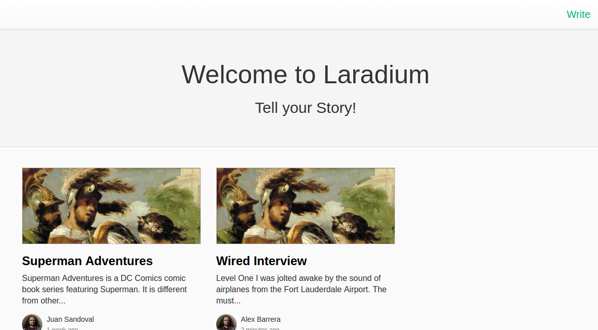
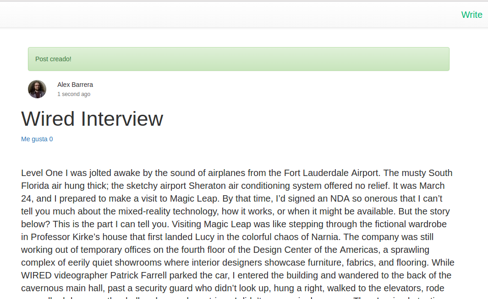
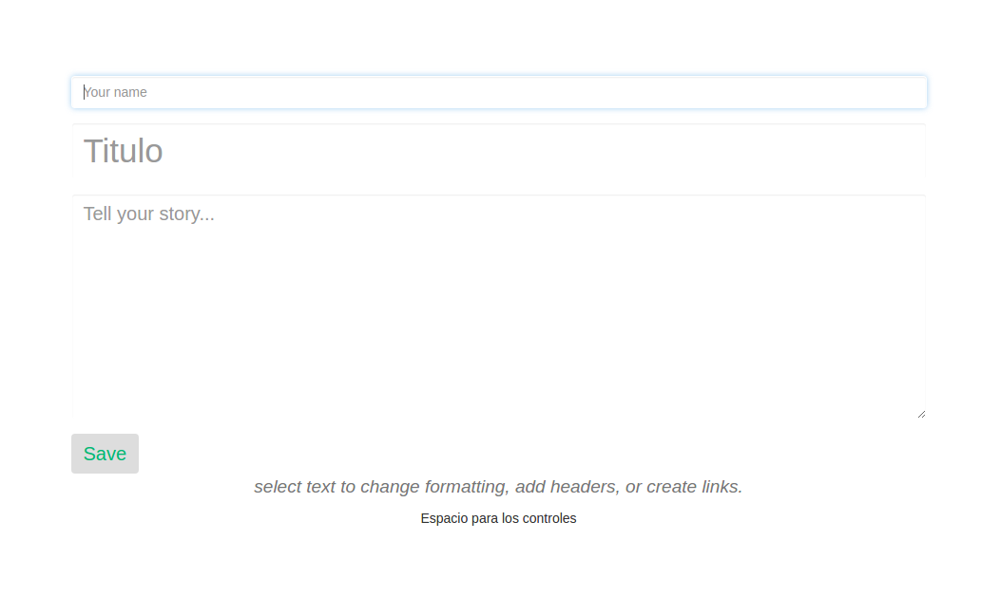
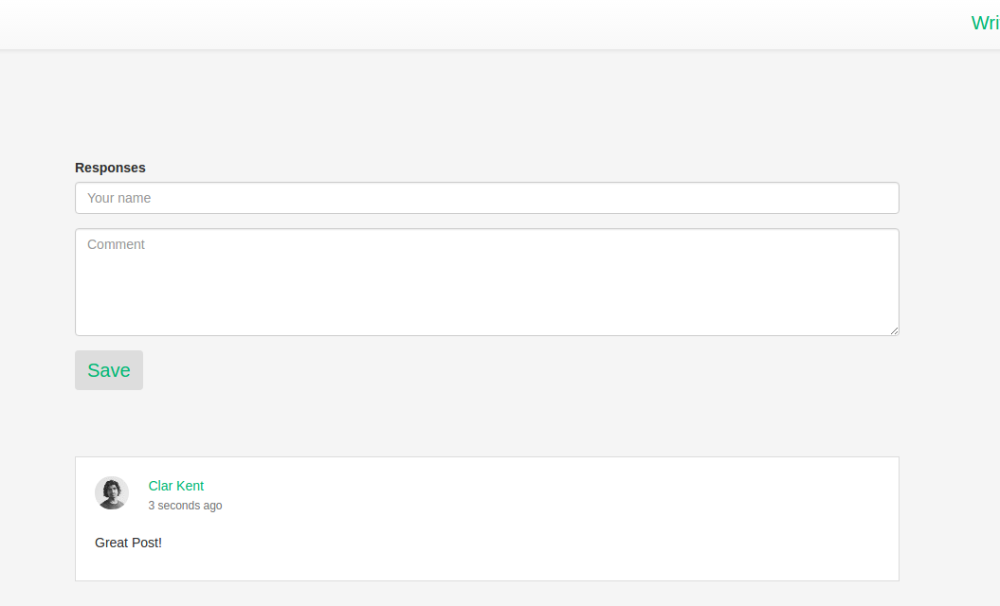

<!DOCTYPE html>
<html>
<head>
	<title>Laradium - ReadME</title>
</head>
<body>
	<h2>Hola!</h2>
	<h4>Este repositorio es un ejemplo de una aplicación hecha en Laravel.</h4>
	
El propósito de esta app, es enseñar a como construir una aplicación usando Laravel 5.4. En ella hay temas como: Capa de modelo de negocio, request and responses HTTP, CRUD, AJAX, responsabilidad de un controlador y modularización de código. Tomando como ejemplo el blog platform Medium.

	
Que fue parte de un mini curso web usando Laravel para la Universidad Piloto SAM en Girardot.

	<a href="https://drive.google.com/drive/folders/0ByBCLqE-_WLTZ0dSdERsa3B2Zms?usp=sharing">Link de las presentaciones y documentación del curso.</a>

	<h4>ScreenShots</h4>

	<h3>Lista Post</h3>
	

	<h3>Detalle de Post</h3>
	
	
	<h3>Crear una Historia</h3>
	

	<h3>Comentarios de Historia</h3>
	

</body>
</html>